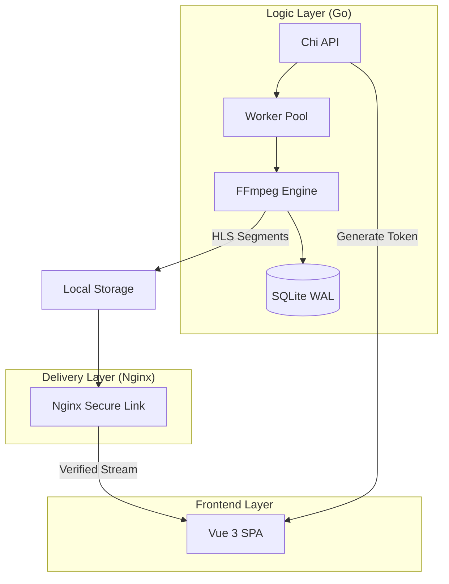

# 🎥 Selvod - Modern Headless VOD Infrastructure

[](./check.sh)
[](LICENSE)
[](backend/go.mod)

**Selvod** is a professional, high-performance Video-on-Demand (VOD) engine built for developers who need secure, automated, and scalable video delivery. 

It handles the entire lifecycle from **raw upload** and **ABR transcoding** to **secure path-based streaming** through a dedicated Nginx sidecar.

---

## 🏗 System Architecture

Selvod uses a decoupled architecture to separate heavy processing from secure delivery.



---

## ✨ Key Features

- **Automated ABR Transcoding:** Single-pass FFmpeg pipeline creating 360p to 1080p HLS variants.
- **Path-Based Security:** RFC 8216 compliant Hardened Secure Link (MD5) URL signing (Tamper-proof).
- **Background Persistence:** Resume-ready uploads powered by a Pinia global store.
- **Hook Registry:** Event-driven system for LMS/CMS integrations.
- **Transcode Efficiency Analytics:** Real-time hardware performance tracking.

---

## 🚀 Deployment in 60 Seconds

1. **Clone & Setup:**
   ```bash
   cp .env.example .env
   ./check.sh # Runs the quality pipeline
   ```

2. **Launch Stack:**
   ```bash
   docker-compose up --build
   ```

3. **Access:**
   - **Dashboard:** `http://localhost:5173`
   - **API Health:** `http://localhost:8080/health`

---

## 🔒 Production Security & Key Generation

> [!WARNING]
> **CRITICAL SECURITY REQUIREMENT:**
> Under no circumstances should default local environment keys be committed to source control or reused in live production environments. Doing so allows malicious actors to sign arbitrary playbacks, gain administrative upload capabilities, or compromise server directories.

To transition to production safely:
1. Generate long, high-entropy random keys:
   ```bash
   # Generate Stream Signer Secret
   openssl rand -hex 32
   
   # Generate Admin API Key
   openssl rand -hex 32
   
   # Generate Playback Scoped Key
   openssl rand -hex 32
   ```
2. Inject these values securely into your production container environment or secret manager (`SV_STREAM_SECRET`, `SV_API_KEY`, `SV_PLAYBACK_KEY`).

---

## 📖 Component Documentation

| Module | Description | Location |
| :--- | :--- | :--- |
| **Backend** | Go Orchestrator & Transcoder | [`/backend`](./backend/README.md) |
| **Frontend** | Vue 3 Reference Dashboard | [`/frontend`](./frontend/README.md) |
| **Nginx** | Secure Delivery Configuration | [`/nginx`](./nginx/README.md) |

---
© 2026 Selvod Open Source Project. Designed for speed, built for scale.
